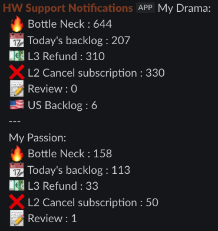

# Operations Department

Support Operations Department Q3-2025 Presentation

---

# Agenda — Q3 results and Q4 plans

  

    <h3 class="text-lg font-semibold mb-2 text-blue-300">Q3 2025 — what we accomplished</h3>
    <ul class="list-disc pl-5 space-y-2 text-white/90">
      <li>Automation (Payment): person‑hour savings for dispute generation; increased case coverage via automation</li>
      <li>Backlog monitoring: for shift leads and management</li>
      <li>Quality Control — AI Review: prompt improvements and high‑level summaries for shift leads</li>
      <li>Feedback: mass outreach invitations — 2,657 chats</li>
    </ul>
  

  

    <h3 class="text-lg font-semibold mb-2 text-emerald-300">Q3 → Q4 2025 — focus</h3>
    <ul class="list-disc pl-5 space-y-2 text-white/90">
      <li>AI support agent: aiming to replace Intercom FinAI</li>
      <li>Significant cost reduction and higher automation</li>
      <li>Universal agent: covers requests and executes actions in external systems</li>
      <li>Smart human handoff when the request cannot be resolved by the agent</li>
      <li>Model-agnostic design: interchangeable LLMs to improve system stability</li>
    </ul>
  

---

# Time Savings — PayPal & Cards

Per-document time vs Total August savings

  

    <h3 class="text-lg font-semibold mb-2 text-blue-300">Per-document time (minutes)</h3>
    <BarChart
      :labels="['PayPal','Cards']"
      :values-a="[9, 17.5]"
      :values-b="[1, 2]"
      label-a="Before automation (min)"
      label-b="After automation (min)"
      y-label="Minutes per document"
      :colors="{ a: 'rgba(96,165,250,0.7)', b: 'rgba(52,211,153,0.7)' }"
    />
    
Documents processed in August: PayPal — 3,682 • Cards — 2,196

  

  

    <h3 class="text-lg font-semibold mb-2 text-emerald-300">Total savings — August (hours)</h3>
    <BarChart
      :labels="['PayPal','Cards']"
      :values-a="[492.6, 575.63]"
      label-a="Saved hours"
      y-label="Hours"
      :colors="{ a: 'rgba(234,179,8,0.8)' }"
    />
    
Total: 1,068.23 hours (≈ 133.5 working days)

  

---

# Slack Backlog Monitoring — Notifications

Targeted alerts for management/product and extended insights for shift leads

  

    <h3 class="text-lg font-semibold mb-2 text-blue-300">What it does</h3>
    <ul class="list-disc pl-5 space-y-1 text-white/90 text-sm leading-snug md:text-base">
      <li>Automated Slack notifications with key backlog metrics and trends</li>
      <li>Tailored presets for management/product vs shift leads</li>
      <li>Extended shift‑lead view: actionable counters for timely interventions</li>
    </ul>
    
Why it helps

    <ul class="list-disc pl-5 space-y-1 text-white/90 text-sm leading-snug md:text-base">
      <li>Faster detection of bottlenecks and SLA risks</li>
      <li>Shared visibility and alignment across teams</li>
      <li>Proactive workload balancing and prioritization</li>
    </ul>

  

  

    
    
Example of daily backlog notifications

  

---

# Quality Control — AI Review Chats Enhancements

Smarter evaluations, shift summaries, and actionable tracking

  

    <h3 class="text-lg font-semibold mb-2 text-blue-300">What we improved</h3>
    <ul class="list-disc pl-5 space-y-1 text-white/90 text-sm leading-snug md:text-base">
      <li>System prompt overhaul: better consistency, clearer criteria, higher accuracy</li>
      <li>Shift summaries: for a selected time range, AI adds extra reviews and concise summaries per agent for shift leads</li>
      <li>Asana integration: auto‑create follow‑up tasks for tracking and ownership</li>
      <li>Editable prompts: two system prompts externalized and handed to the QC team for continuous improvement</li>
    </ul>
  

  

    <h3 class="text-lg font-semibold mb-2 text-emerald-300">Outcomes</h3>
    <ul class="list-disc pl-5 space-y-1 text-white/90 text-sm leading-snug md:text-base">
      <li>Faster feedback loops for shift leads and agents</li>
      <li>Higher evaluation consistency and transparency</li>
      <li>Clear ownership and progress tracking in Asana</li>
    </ul>
    <h3 class="text-base font-semibold mt-6 mb-2 text-rose-300">Trustpilot outreach</h3>
    
Prepared and launched Intercom invitations inviting users to leave a review on Trustpilot — 2,657 invitations sent. This became a foundational step for future support‑led campaigns and special offers.

  

---

# AI Support Agent — Key Capabilities

Direct Intercom presence, rich context, external data, actions, and escalation

  

    <h3 class="text-lg font-semibold mb-2 text-blue-300">Agent identity & chat rules</h3>
    <ul class="list-disc pl-5 space-y-1 text-white/90 text-sm leading-snug md:text-base">
      <li>Dedicated Intercom seat: chats under its own account, like a human agent</li>
      <li>Works within our chat guidelines, best practices, and internal SOPs</li>
      <li>Trained on internal documentation curated by shift leads</li>
    </ul>
  

  

    <h3 class="text-lg font-semibold mb-2 text-emerald-300">Context, knowledge, and actions</h3>
    <ul class="list-disc pl-5 space-y-1 text-white/90 text-sm leading-snug md:text-base">
      <li>Conversation context from Intercom (history and metadata)</li>
      <li>On‑demand data from external systems: Amplitude and SolidGate when needed</li>
      <li>Function calling: not only reads data, but also performs actions in external systems</li>
      <li>Smart escalation: hands off to a human when unable to resolve</li>
    </ul>
  

---

# AI Support Agent — Cost Comparison

FinAI pay-per-resolution vs in-house GPT-5 API usage — estimated monthly costs

  

    
Assumptions

    <ul class="list-disc pl-5 space-y-1 text-white/90 text-sm leading-snug md:text-base">
      <li>FinAI: $0.99 per resolved conversation (excl. Intercom seat fees)</li>
      <li>Scenarios: 50k and 60k conversations per month</li>
      <li>GPT-5 API (flagship): ~$0.0025–0.003 per typical request</li>
    </ul>
  

    
Interpretation

    <ul class="list-disc pl-5 space-y-1 text-white/90 text-sm leading-snug md:text-base">
      <li>In-house GPT-5 is orders of magnitude cheaper at similar volumes</li>
      <li>Savings exclude engineering time; still material at any volume</li>
    </ul>
  

  

  

    
Estimated monthly cost

    <BarChart
      :labels="['50k','60k']"
      :values-a="[49500, 59400]"
      :values-b="[1000, 1300]"
      label-a="FinAI"
      label-b="GPT-5"
      y-label="USD / month"
      :colors="{ a: 'rgba(96,165,250,0.7)', b: 'rgba(52,211,153,0.8)' }"
    />
    
Approx. savings vs FinAI: 49,350 (50k); 59,220 (60k). Notes: FinAI costs reflect $0.99/resolution only. GPT-5 costs based on flagship pricing $1.25/M input, $10/M output tokens; real totals depend on token usage.

  

