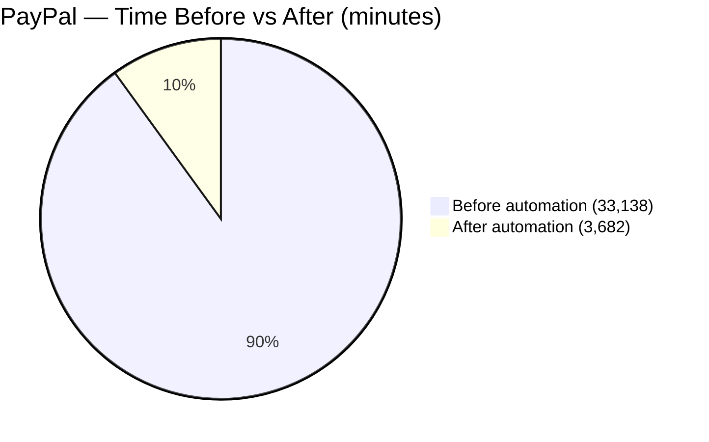

# Operations Department

Support Operations Department Q3-2025 Presentation

---

layout: center
class: 'bg-black text-white'

# Time Savings — PayPal & Cards

Automation impact on document preparation time (minutes)

  

    <h3 class="text-xl font-semibold mb-2 text-blue-300">PayPal</h3>

    

      
Documents: 3,682

      
Avg time before: 9 min • after: 1 min

    

  

  

    <h3 class="text-xl font-semibold mb-2 text-emerald-300">Cards</h3>

    

      
Documents: 2,196

      
Avg time before: 17.5 min • after: 2 min

    

  

  

    
PayPal Savings

    
492.6 h

    
≈ 61.6 working days

  

  

    
Cards Savings

    
575.63 h

    
≈ 71.95 working days

  

  

    
Total Savings

    
1,068.23 h

    
≈ 133.5 working days

  

  PayPal
  Cards
  Total Impact

